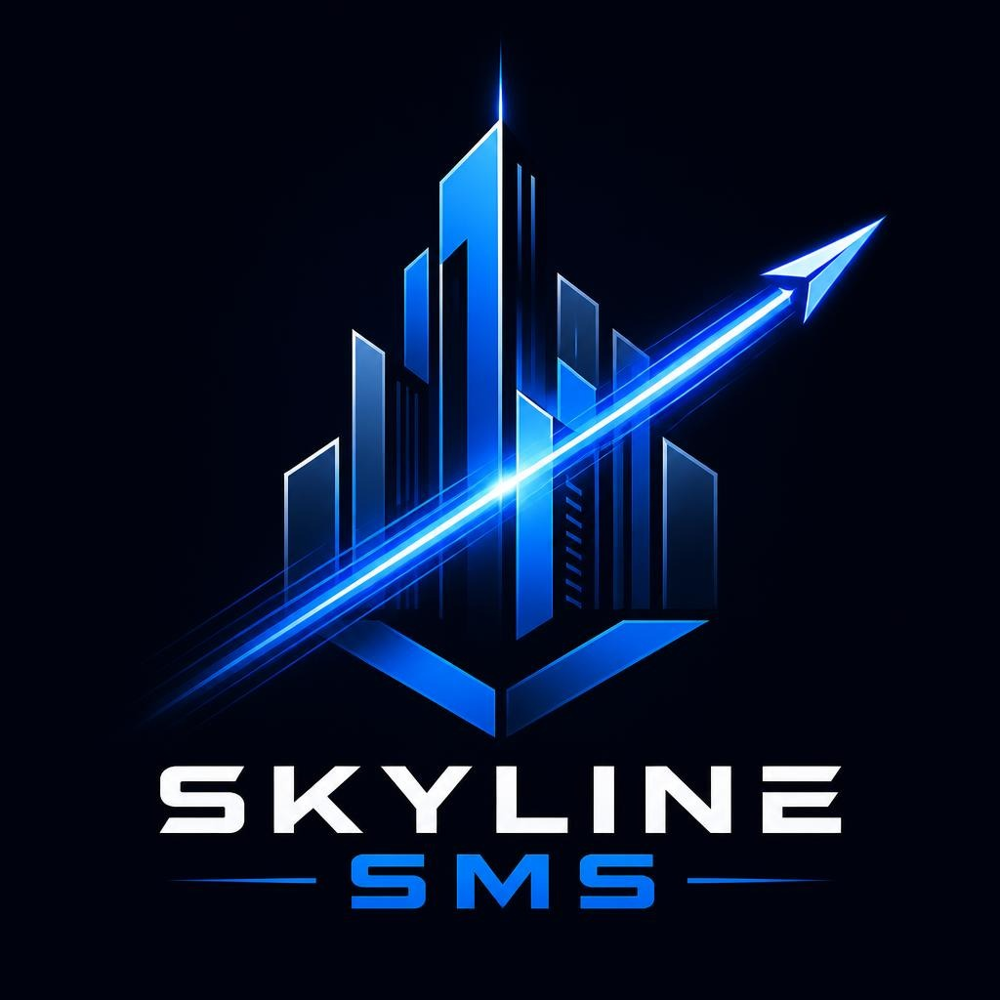

# SKYLINE SMS — High-Velocity Enterprise SMS Gateway



**SKYLINE SMS** is a carrier-grade, multi-tenant SMS & OTP management gateway designed for telecommunications aggregators, bulk messaging providers, and high-frequency OTP routing networks. 

Engineered with architectural cobalt aesthetics, sub-second SQLite write-ahead logging (WAL), robust role-based access control (RBAC), real-time SMPP bindings, and automated carrier settlement workflows.

---

## 🌟 Key Platform Features

- **Multi-Tier Hierarchical Operations**:
  - **Admin Control Center**: Full telemetry, financial ledger, SMPP routing, provider registry, user quotas, and disaster recovery.
  - **Manager Portal**: Team delegation, pooled allocation, margin management, and client grouping.
  - **Agent Hub**: Rapid number pool assignment, TRC20 wallet management, settlement notifications, and built-in **Skyline AI Assistant**.
  - **Client View**: Real-time incoming SMS feed with sub-second OTP extraction, CLI filtering, and instant CSV exports.
  - **Specialized Workspaces**: Dedicated portals for **Management**, **Payment Clearance**, **Panel Sharing Upstream/Downstream**, and an isolated **Test Sandbox**.
- **Telecom-Grade Protocol Ingestion**:
  - High-concurrency HTTP webhooks (`/api/incoming-sms`).
  - Integrated SMPP service supporting transceiver binds, auto-reconnect, and asynchronous DLR handling.
  - E.164 normalization, CLI prefix matching, and deduplication guards.
- **Architectural UI & Design System**:
  - Bold Cobalt (`#2563eb`), Deep Navy (`#080c14` / `#0c1220`), and Sky Cyan telemetry accents.
  - One-click dual-mode toggle (Enterprise Dark & Crisp High-Contrast Light theme).
  - Responsive layout for desktop, laptop, tablet, and mobile.
- **Intelligent Agent AI Assistant**:
  - Embedded assistant trained on real-time carrier ranges, rates, and availability.
  - Automatic escalation guards for payment schedules and policy boundaries.
- **Financial & Settlement Ledger**:
  - Multi-cycle rate cards: Daily, Weekly (7/1, 7/7), and Monthly (30x45).
  - Automated agent withdrawal request tracking with proof-of-payment screenshot uploads.

---

## 🚀 Quickstart & Local Installation

### Prerequisites
- Node.js >= 20.x
- Python 3 / Build tools (for `better-sqlite3` native compilation)

### 1. Clone & Install
```bash
git clone https://github.com/<YOUR_USER>/skyline-sms.git
cd skyline-sms
npm install
```

### 2. Configure Environment
Copy `.env.example` to `.env`:
```bash
cp .env.example .env
```
Key configuration settings in `.env`:
```env
PORT=4000
JWT_SECRET=replace_with_a_super_strong_production_secret
BACKUP_DIR=/root/skyline-sms-backups
BACKUP_INTERVAL_HOURS=3
BACKUP_RETENTION_DAYS=7
LOGIN_RATE_LIMIT=100
```

### 3. Start the Server
```bash
# Production start
npm start

# Development mode
npm run dev
```

Visit the gateway at `http://localhost:4000` (automatically routes to `/panel-login`).

---

## 🔐 Default Seed Credentials

| Role | Username | Password | Default URL |
| :--- | :--- | :--- | :--- |
| **Admin** | `vibepk` | `vibepk123` | `/admin` |
| **Test Role** | `test` | `test123` | `/test` |

*Note: Default passwords should immediately be updated via the Profile menu upon initial deployment.*

---

## 📁 Repository Structure

```
.
├── admin.html               # Admin Gateway control interface
├── manager.html             # Manager operations dashboard
├── agent.html               # Agent number allocation & AI panel
├── client.html              # Client real-time SMS stream
├── management.html          # Extended carrier & accounting controls
├── payment.html             # Financial settlement & audit workspace
├── panel-sharing.html       # Webhook routing & forward rules
├── test.html                # Isolated carrier test sandbox
├── login.html               # Unified enterprise authentication portal
├── api.js                   # Unified frontend API client & response cache
├── assets/                  # Official Skyline SMS brand assets, CSS & JS
│   ├── skyline-logo.png     # Primary rectangular brand mark
│   ├── skyline-mark.png     # Shield monogram badge
│   ├── skyline-favicon.png  # Vector browser favicon
│   ├── skyline.css          # Architectural Cobalt dark theme system
│   ├── skyline-light.css    # High-contrast enterprise light theme
│   └── skyline.js           # Shared navigation, notifications & theme toggle
├── backend/
│   ├── server.js            # Express application, clean routes & REST endpoints
│   ├── schema.js            # SQLite database tables & automated migrations
│   ├── db.js                # SQLite WAL wrapper
│   ├── auth.js              # JWT validation & RBAC permission gates
│   ├── assistant.js         # Skyline AI Assistant engine & knowledge base
│   ├── smppService.js       # Native SMPP server & carrier listener
│   └── backup.js            # Automated background VPS database snapshot engine
├── scripts/
│   ├── capture-all-screenshots.js  # Automated Puppeteer screenshot generator
│   └── install-service.sh   # Systemd service installer
├── screenshots/             # 52 High-resolution captures (both themes)
└── tests/
    └── p12-regression.js    # Comprehensive automated test suite
```

---

## 📸 Platform Screenshots (Both Themes)

Full high-resolution screenshots for all 9 panels and every functional section in both **Dark Mode** and **Light Mode** are included in the `/screenshots/` directory:

| Panel | Dark Theme | Light Theme |
| :--- | :--- | :--- |
| **Enterprise Login** | `screenshots/01_login_portal_default_dark.png` | `screenshots/01_login_portal_default_light.png` |
| **Admin Dashboard** | `screenshots/02_admin_dashboard_dark.png` | `screenshots/02_admin_dashboard_light.png` |
| **Admin Numbers** | `screenshots/02_admin_numbers_dark.png` | `screenshots/02_admin_numbers_light.png` |
| **Admin Live SMS** | `screenshots/02_admin_live_sms_dark.png` | `screenshots/02_admin_live_sms_light.png` |
| **Admin Users** | `screenshots/02_admin_users_dark.png` | `screenshots/02_admin_users_light.png` |
| **Admin Settlements** | `screenshots/02_admin_payment_mgmt_dark.png` | `screenshots/02_admin_payment_mgmt_light.png` |
| **Admin AI Knowledge** | `screenshots/02_admin_ai_assistant_dark.png` | `screenshots/02_admin_ai_assistant_light.png` |
| **Manager Portal** | `screenshots/03_manager_dashboard_dark.png` | `screenshots/03_manager_dashboard_light.png` |
| **Agent Workspace** | `screenshots/04_agent_dashboard_dark.png` | `screenshots/04_agent_dashboard_light.png` |
| **Client Live Stream** | `screenshots/05_client_dashboard_dark.png` | `screenshots/05_client_dashboard_light.png` |
| **Carrier Management** | `screenshots/06_management_dashboard_dark.png` | `screenshots/06_management_dashboard_light.png` |
| **Payment Auditing** | `screenshots/07_payment_dashboard_dark.png` | `screenshots/07_payment_dashboard_light.png` |
| **Panel Sharing** | `screenshots/08_panel_sharing_dashboard_dark.png` | `screenshots/08_panel_sharing_dashboard_light.png` |
| **Test Sandbox** | `screenshots/09_test_panel_dashboard_dark.png` | `screenshots/09_test_panel_dashboard_light.png` |

---

## 📤 Uploading to a New GitHub Repository

To upload this clean codebase to your new GitHub repository, run the following commands:

```bash
# 1. Initialize git repository (if not already done)
git init -b main

# 2. Stage all project files (node_modules and local DB are ignored by .gitignore)
git add .

# 3. Create initial rebrand commit
git commit -m "feat: complete enterprise rebrand to SKYLINE SMS v2.0"

# 4. Link to your new GitHub remote
git remote add origin https://github.com/<YOUR_USER>/skyline-sms.git

# 5. Push to GitHub
git push -u origin main
```

Alternatively, download `skyline-sms-release.zip` directly from this repository and upload it using GitHub's web interface.

---

## 🛡️ License

Proprietary — All rights reserved. SKYLINE SMS Enterprise Telecom Infrastructure.
